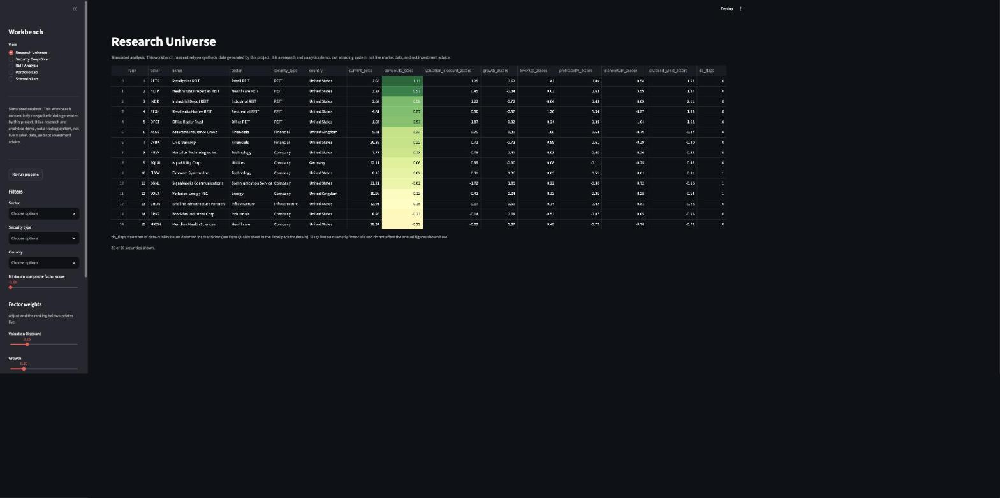
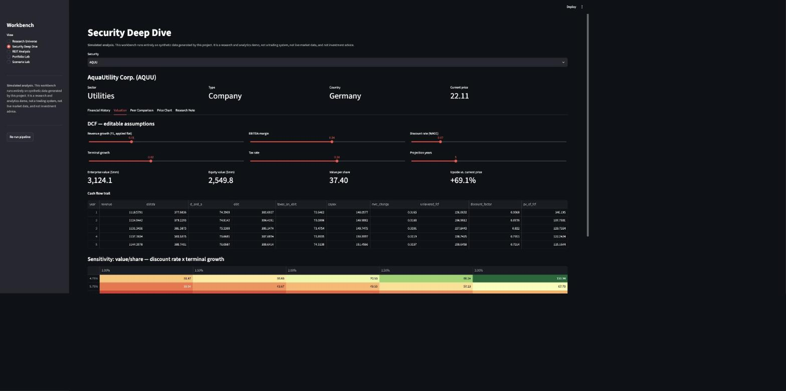
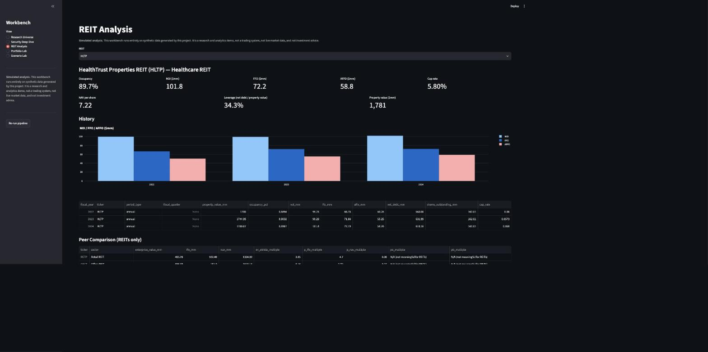
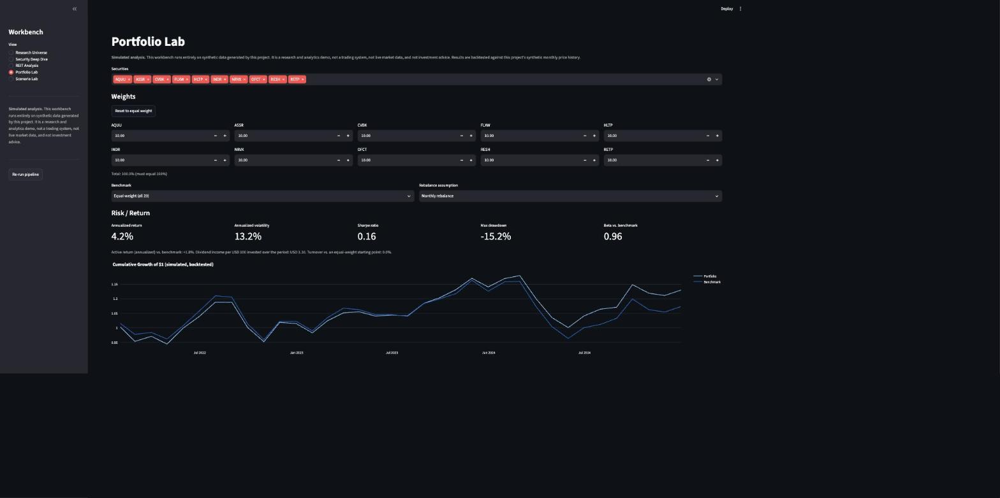
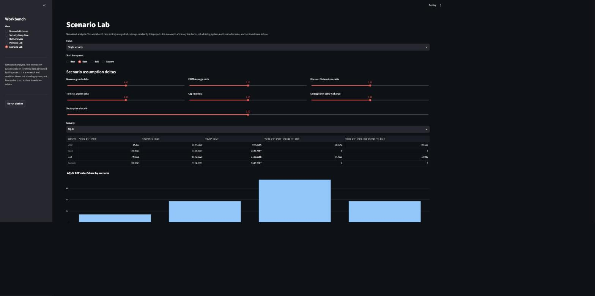

# Investment Research & Portfolio Analytics Workbench

> **This is a portfolio simulation project, not investment advice, not live
> market data, not a trading system, and not a production financial model.**
> Every number in this repository — prices, financials, events, valuations,
> portfolio returns — is generated by `src/generate_data.py` from a fixed
> random seed. No real company, security, index, or market data is used
> anywhere. Do not use this project, or any output it produces, to make a
> real investment decision.

A reproducible Python/SQLite research pipeline that
demonstrates the day-to-day workflow of a junior public-markets research
analyst: organize company and REIT financial data, value securities several
ways, screen and rank a universe, build a portfolio, stress-test it under
scenarios, and write up a research note — with every number traceable back to
stored data or a documented assumption.

## Table of contents

- [Analyst workflow](#analyst-workflow)
- [Architecture](#architecture)
- [Setup](#setup)
- [What each command does](#what-each-command-does)
- [Screenshots](#screenshots)
- [Assumptions](#assumptions)
- [Calculation definitions](#calculation-definitions)
- [Synthetic-data limitations](#synthetic-data-limitations)
- [How to interpret the research note](#how-to-interpret-the-research-note)
- [Tests and verification](#tests-and-verification)

## Analyst workflow

This project mirrors the steps a junior analyst actually goes through:

1. **Organize data.** Pull raw financials, prices, and events into a
   consistent schema; catch the data-quality problems that always show up in
   real feeds (missing quarters, duplicate rows, unit mismatches, impossible
   negative values) *before* they corrupt a valuation.
2. **Value companies.** Build a DCF from the company's own historical
   trajectory, cross-check it against trading comparables, and know how
   sensitive the answer is to the assumptions that drove it.
3. **Value REITs differently.** REITs aren't companies with a DCF bolted on —
   NAV (property value less net debt) and a capitalization-rate cross-check
   are the right tools, with FFO/AFFO instead of net income/EPS.
4. **Screen and rank.** Turn valuation, growth, leverage, profitability,
   momentum, and yield into a transparent, reweightable composite score — no
   black-box "buy/sell" signal.
5. **Build a portfolio.** Pick names and weights, measure risk/return against
   a benchmark, and know which names are actually driving return and risk.
6. **Stress-test it.** Move discount rates, cap rates, margins, and leverage
   and see what breaks, both at the security level and the portfolio level.
7. **Write it up.** A research note that states the bull/base/bear cases, the
   catalysts and risks, and — critically — every assumption it used to get
   there.

## Architecture

```text
data/raw/            synthetic source-of-truth CSVs (generate_data.py output)
data/processed/      research.db (normalized SQLite store) + equivalent CSVs for the Excel pack
output/              investment_research_pack.xlsx + research_note_<TICKER>.md

src/generate_data.py     synthetic dataset generator (fixed seed = reproducible)
src/ingest.py            schema validation, dedup, data-quality detection
src/db.py                SQLite schema + read/write for the normalized data/processed/research.db store
src/valuation.py         DCF, comparables, REIT NAV, cap-rate check, sensitivity tables
src/portfolio.py         weights, returns, risk metrics, concentration, contribution
src/scenarios.py         Bull/Base/Bear scenario deltas applied to valuation + portfolio
src/screen.py            multi-factor screen + research-note template
src/analytics_pipeline.py  glue layer: turns processed data into the analytics both
                            run_pipeline.py (static Excel/Markdown) and app.py (live) need
src/reporting.py         Excel workbook + Markdown report writers (formatting only)

app.py                   Streamlit workbench (5 views, described below)
scripts/run_pipeline.py  generate -> ingest -> value -> screen -> portfolio -> report
scripts/verify_project.py runs pipeline + tests + independent recomputation
tests/                    pytest suite (see "Tests and verification")
```

Nothing in `app.py` or `reporting.py` hard-codes a number. Both call the same
functions in `src/analytics_pipeline.py`, `src/valuation.py`,
`src/portfolio.py`, and `src/scenarios.py` — the Streamlit app just calls them
live against whatever the user selects, and the pipeline calls them once to
freeze a snapshot into the Excel pack.

## Setup

Requires Python 3.11+.

```bash
python3 -m venv .venv
source .venv/bin/activate        # Windows: .venv\Scripts\activate
pip install -r requirements.txt

python scripts/run_pipeline.py   # generates data, runs valuations, writes output/
python scripts/verify_project.py # runs the pipeline + tests + independent checks
streamlit run app.py             # opens the interactive workbench
```

A fresh run of `scripts/verify_project.py` ends with exactly:

```text
VERIFY PASSED: Investment Research & Portfolio Analytics Workbench
```

If you open `app.py` before ever running the pipeline, it shows a setup
message with a "Run pipeline now" button instead of crashing.

## What each command does

- **`python scripts/run_pipeline.py`** — generates the synthetic dataset with
  a fixed seed, validates and deduplicates it, writes
  `data/processed/data_quality.csv` (every detected issue) and
  `data/processed/data_dictionary.csv` (every transformed field explained),
  runs DCF/comparables/NAV/cap-rate valuation for all 20 securities, runs the
  factor screen, builds the Model Portfolio, runs Bull/Base/Bear scenarios,
  and writes `output/investment_research_pack.xlsx` plus a one-page
  `output/research_note_<TICKER>.md` for the top-ranked security.
- **`python scripts/verify_project.py`** — re-runs the pipeline, runs the
  full `pytest` suite, checks every required output file and Excel sheet
  exists, and *independently* recomputes a DCF value/share, a REIT NAV/share,
  and the Model Portfolio's Sharpe ratio from raw formulas (not by calling
  `src/valuation.py` or `src/portfolio.py`) to cross-check the pipeline's own
  numbers before printing the pass line.
- **`streamlit run app.py`** — the interactive workbench described below.

## Screenshots

All data below is synthetic — see the disclaimer at the top of this file.

### Research Universe
Filter by sector/type/country, adjust factor weights, and watch the ranking
update live. `dq_flags` surfaces which tickers have a detected data-quality
issue.



### Security Deep Dive
Editable DCF assumptions recompute enterprise value, equity value, and the
full cash-flow trail live, alongside a discount-rate × terminal-growth
sensitivity heatmap.



### REIT Analysis
NOI/FFO/AFFO history, NAV, cap-rate cross-check, occupancy, and leverage,
with non-REIT-meaningful multiples (P/E, P/B) explicitly marked N/A.



### Portfolio Lab
Pick securities and weights (validated to sum to 100%), choose a benchmark
and rebalance assumption, and see risk/return, concentration, and
cumulative-growth results — clearly labeled as backtested/simulated.



### Scenario Lab
Start from a Bull/Base/Bear preset or build a custom scenario, applied to a
single security's DCF/NAV or to the whole Model Portfolio's weighted-average
fair value and largest-sector price shock.



## Assumptions

All of these are also written out in the **Assumptions and Data Dictionary**
sheet of the Excel pack, alongside every field's definition.

| Assumption | Default | Where used |
|---|---|---|
| Discount rate | `risk_free_rate (4%) + beta * equity_risk_premium (5%)` (CAPM) | DCF |
| Terminal growth (base case) | 2.0% | DCF Gordon-growth terminal value |
| Tax rate | 24% | DCF unlevered FCF |
| Projection horizon | 5 years | DCF |
| Comparable peer groups | Company (12) / REIT (5) / Financial-Infrastructure (3) | Trading comparables |
| Rebalance assumption | Monthly rebalance to target weights (a buy-and-hold "none" mode is also implemented) | Portfolio Lab |
| Risk-free rate (Sharpe) | 2.0% | Portfolio Sharpe ratio |
| Model Portfolio construction | Top 10 factor-ranked securities, weighted by shifted/normalized composite score | Portfolio Analytics / Scenario Lab |
| Bull / Base / Bear deltas | See `src/scenarios.py` (`BULL`, `BASE`, `BEAR`) | Scenario Lab, Excel Scenario Analysis sheet |
| Factor screen default weights | valuation 25%, growth 20%, leverage 15%, profitability 15%, momentum 15%, yield 10% | Research Universe / research note |

## Calculation definitions

- **DCF enterprise value**: unlevered FCF = EBITDA − D&A-driven taxes on EBIT
  − capex − Δ net working capital, discounted at the WACC proxy above, plus a
  terminal value (Gordon growth *or* an EV/EBITDA exit multiple — both are
  implemented in `src/valuation.py::run_dcf`). Equity value = EV − net debt.
- **Trading comparables**: peer group's *median* multiple (EV/EBITDA, P/E,
  P/B, or P/FFO for REITs) applied to the target's own metric.
- **REIT NAV**: `(property value − net debt) / shares outstanding`.
- **REIT cap-rate cross-check**: `NOI / property value`, compared against the
  reported cap rate; also backs into an implied property value at a
  reference rate.
- **Portfolio annualized return / volatility**: geometric compounding of
  monthly returns, annualized volatility = monthly std × √12.
- **Max drawdown**: minimum of `cumulative / running_max − 1` over the
  period.
- **Sharpe ratio**: `(annualized return − 2% risk-free) / annualized
  volatility`.
- **Beta**: `cov(portfolio, benchmark) / var(benchmark)` on monthly returns.
- **Contribution to risk**: standard variance decomposition,
  `w_i * (Σw)_i / portfolio_variance`, sums to 1.0 across holdings.

## Synthetic-data limitations

- 20 fictional securities (12 companies, 5 REITs, 3 financial/infrastructure)
  over 3 fiscal years (2022–2024) of annual and quarterly financials, and 36
  months of price history — generated once with a fixed seed
  (`SEED = 42` in `src/generate_data.py`) so every run is identical.
- Share prices are tied to each company's own book value per share (via a
  per-ticker market-pricing multiple with noise), *not* copied from any real
  market, so DCF/comps-implied "upside" reflects the synthetic mispricing the
  generator introduced — not a real signal about any real security.
- Four data-quality issues are deliberately planted (one missing quarterly
  value, one duplicate observation, one unit mismatch, one negative-value
  anomaly) so `src/ingest.py` has something real to catch; it detects them
  independently, without reading the generator's internal manifest.
- All company events (earnings dates, guidance changes, acquisitions, sector
  events) are fabricated and labeled `[SYNTHETIC]` in their description.

## How to interpret the research note

`output/research_note_<TICKER>.md` (and the **Research Note** tab in the
Streamlit app's Security Deep Dive view) follows a standard sell-side
structure: business/sector summary, valuation overview (current price vs.
DCF/NAV vs. comparables), factor-screen rank, catalysts and risks pulled from
the synthetic event log, key assumptions, and Bull/Base/Bear target values.
Every number in it is pulled from `data/processed/research.db` or computed by
`src/valuation.py` / `src/scenarios.py` — nothing is invented by the template.
Treat it exactly as what it says at the top: **simulated analysis**,
demonstrating a workflow and a calculation trail, not a real opinion about a
real security.

## Tests and verification

`tests/` (44 tests, run via `pytest tests/`) proves:

- the fixed seed reproduces byte-identical raw data across runs;
- all four planted data-quality issues are detected by `src/ingest.py`
  independently (it never reads the generator's manifest);
- DCF, comparables, REIT NAV, and cap-rate formulas match hand-calculated
  examples;
- changing a DCF assumption (discount rate, terminal growth, revenue growth)
  moves the valuation in the expected direction;
- portfolio weights are validated (must sum to 100%, no negative weights)
  before any analytics run;
- benchmark, return, volatility, drawdown, beta, and risk-contribution
  calculations are reproducible and match manual computations on known
  series;
- the factor screen's ranking actually changes when factor weights change;
- every required Excel sheet and its key columns exist.

`scripts/verify_project.py` runs all of the above plus an independent,
from-scratch recomputation (not calling the project's own functions) of a
DCF value, a REIT NAV, and the Model Portfolio's Sharpe ratio, and only then
prints `VERIFY PASSED: Investment Research & Portfolio Analytics Workbench`.
